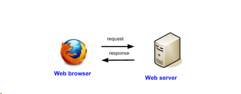
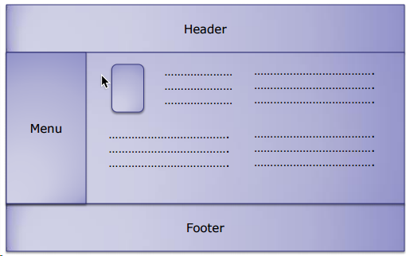

# ☠️🎨Week 2: HTML part 1
Welcome to Week 2 of my journey learning Web Programming🌐😤 This Week, we'll covering basic usage of HTML and CSS.
## ☠️HTML
HTML(*Hypertext Markup Language*) is a standard markup language used to create web pages. It is a basic element of the World Wide Web and allows web authors to organize the structure and content of a web page. HTML uses tags and attributes to determine how the content of a web page will be displayed in a web browser. Not Sensitivity to case. Basic structure of HTML:
```html
<!DOCTYPE html>
<html>
  <head>
    <title>Page Title</title>
  </head>
  <body>
    <h1>This is a Heading</h1>
    <p>This is a paragraph.</p>
  </body>
</html>
```
### 🏷️ HTML Tags
HTML tags are element names surrounded by angle brackets. Tags usually come in pairs, an opening tag and a closing tag. The closing tag has a forward slash before the tag name. The opening tag is the name of the element, surrounded by angle brackets. The closing tag is the same as the opening tag, except that it includes a forward slash before the element name. The closing tag is placed after the content of the element. For example, a paragraph is created by placing the content of the paragraph between the opening and closing paragraph tags:
- Table
```html
<table>
  <tr>
    <th>Firstname</th>
    <th>Lastname</th>
    <th>Age</th>
  </tr>
  <tr>
    <td>Jill</td>
    <td>Smith</td>
    <td>50</td>
  </tr>
  <tr>
    <td>Eve</td>
    <td>Jackson</td>
    <td>94</td>
  </tr>
</table>
```
- Form
```html
<form action="/action_page.php">
  <label for="fname">First name:</label><br>
  <input type="text" id="fname" name="fname"><br>
  <label for="lname">Last name:</label><br>
  <input type="text" id="lname" name="lname"><br><br>
  <input type="submit" value="Submit">
</form>
```
- Input text
```html
<input type="text" id="fname" name="fname">
```

- Input password
```html
<input type="password" id="pwd" name="pwd">
```

- Checkbox
```html
<input type="checkbox" id="vehicle1" name="vehicle1" value="Bike">
<label for="vehicle1"> I have a bike</label><br>
```
- Radio
```html
<input type="radio"/>
```
- Button
```html
<button>Click me</button>
```
- Reset button
```html
<input type="reset" value="Reset">
```
- Submit button
```html
<input type="submit" value="Submit">
```
- Select
```html
<select>
  <option value="volvo">Volvo</option>
  <option value="saab">Saab</option>
  <option value="mercedes">Mercedes</option>
  <option value="audi">Audi</option>
</select>
```
- Textarea
```html
<textarea name="message" rows="10" cols="30">
The cat was playing in the garden.
</textarea>
```
 ## 🎨CSS 
CSS(*Cascading Style Sheets*) is a styling language used to control the presentation or layout of web pages written in HTML. With CSS, web developers can control the visual appearance of HTML elements, such as color, text size, spacing between elements, and layout. CSS is used to define styles for your web pages, including the design, layout, and variations in display for different devices and screen sizes. CSS is independent of HTML and can be used with any XML-based markup language. CSS is used to define styles for your web pages, including the design, layout, and variations in display for different devices and screen sizes. CSS is independent of HTML and can be used with any XML-based markup language. Basic structure of CSS:
```css
body {
  background-color: lightblue;
}
```
### Basic Usage
- Inline CSS
```html
<!DOCTYPE html>
<html>
  <head>
    <style>
      body {background-color: powderblue;}
      h1   {color: blue;}
      p    {color: red;}
    </style>
  </head>
  <body>
    <h1>This is a heading</h1>
    <p>This is a paragraph.</p>
  </body>
</html>
```
- Internal CSS
```html
<!DOCTYPE html>
<html>
  <head>
    <style>
      body {background-color: linen;}
    </style>
  </head>
  <body>
    <h1>This is a heading</h1>
    <p>This is a paragraph.</p>
  </body>
</html>
```
- External CSS
```html
<!DOCTYPE html>
<html>
  <head>
    <link rel="stylesheet" type="text/css" href="styles.css">
  </head>
  <body>
    <h1>This is a heading</h1>
    <p>This is a paragraph.</p>
  </body>
</html>
```
- Multiple CSS
```html
<!DOCTYPE html>
<html>
  <head>
    <link rel="stylesheet" type="text/css" href="styles.css">
    <style>
      body {background-color: linen;}
    </style>
  </head>
  <body>
    <h1>This is a heading</h1>
    <p>This is a paragraph.</p>
  </body>
</html>
```

## 🌐How Internet Works

- **Client**: A client is a computer program that requests a service from a server. A web browser is an example of a client. Example: Chrome, Firefox, Safari, etc.
- **Server**: A server is a computer program that provides services to other computer programs in the same or other computers. A web server is a program that uses HTTP (Hypertext Transfer Protocol) to serve the files that form web pages to users, in response to their requests, which are forwarded by their computers' HTTP clients. Example: Apache, Nginx, IIS, etc.
- **HTTP**: The Hypertext Transfer Protocol (HTTP) is an application protocol for distributed, collaborative, hypermedia information systems. HTTP is the foundation of data communication for the World Wide Web, where hypertext documents include hyperlinks to other resources that the user can easily access, for example by a mouse click or by tapping the screen in a web browser.
- **HTTPS**: HTTPS (Hypertext Transfer Protocol Secure) is an internet communication protocol that protects the integrity and confidentiality of data between the user's computer and the site. Users expect a secure and private online experience when using a website. For the connection to be secure, the browser and the website need to establish a secure connection. This is done using the SSL (Secure Socket Layer) or TLS (Transport Layer Security) protocol. 

So that the web browser (client) and the web servers can communicate with each other — the same language — HTTP — and the client must understand HTML.

## 😩Posttest


Try to make a HTML layout like those picture, and then make a CSS to make it more beautiful. You can use any text editor to make it, and then open it with your web browser. Good luck!👍🏻
you can take a look at [my work](02-posttest-html-css.html)


