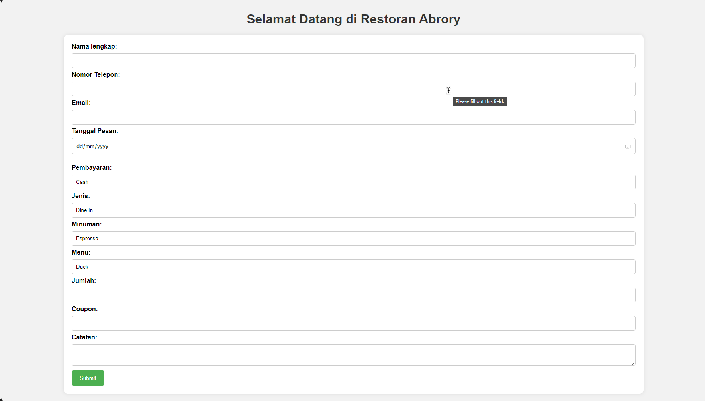
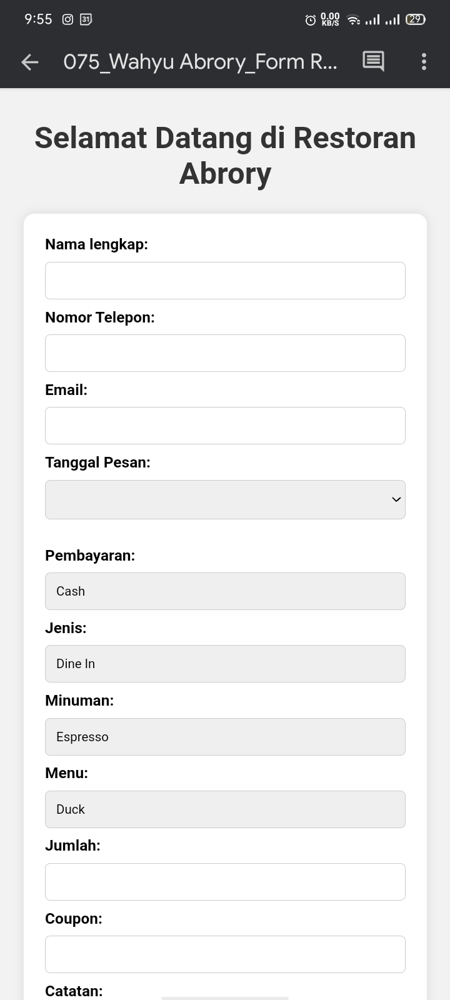

# Week 3: HTML Part 2 (HTML5)

In this brief session, we'll craft forms tailored to different case studies. Our goal: 10 unique forms, each reflecting a distinct scenario. Before diving in, we'll recap our previous lesson. Additionally, we'll delve into HTML5 & PHP.

## 🎯Challenge: 10 form inputs for various case studies
The form I've developed serves as a straightforward tool for user input, constructed with HTML and CSS. Below, I offer a glimpse into the progress made this week.
|Desktop|Mobile|
|---|---|
|||

You can also find the code for the form in the [form.html](10form-resto-case.html) file.

In this challenge, I've created a form for a restaurant reservation. The form includes fields for the user's name, phone number, email, date, time, and the number of guests. The form also features a submit button, which sends the user's input to the server.