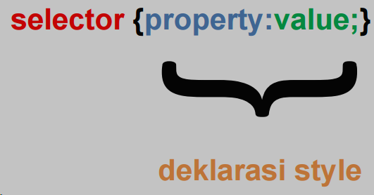
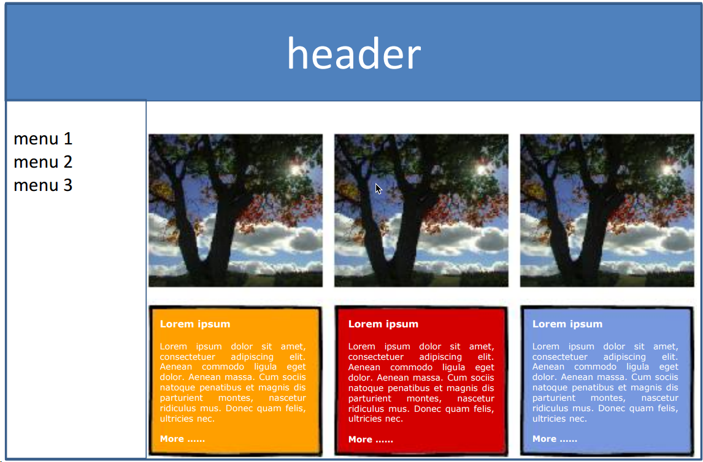

# 🎨Week 4: CSS

In this week, we will cover some basic CSS properties and how to use them. We will also learn how to use CSS to style our HTML pages. Firstly first

## 🤔What's CSS

So basically CSS is a styling language used to control the presentation or layout of web pages written in HTML. With CSS, web developers can control the visual appearance of HTML elements, such as colour, text size, spacing between elements, and layout. CSS is used to define styles for your web pages, including the design, layout, and variations in display for different devices and screen sizes. CSS is independent of HTML and can be used with any XML-based markup language. CSS is used to define styles for your web pages, including the design, layout, and variations in display for different devices and screen sizes. CSS was very useful for creating `Unified Look`.

## 🧐Why CSS

- HTML acts as the foundational structure of a web page, organizing our content in a logical manner.
- CSS adds the aesthetic flair, elevating our designs from simple layouts to visually captivating experiences.
- Classes and IDs in CSS streamline our coding process, eliminating the need to repetitively describe individual elements.
- By harnessing the power of classes and IDs, we enhance code efficiency and readability, paving the way for smoother development and maintenance.
- Through the strategic application of classes and IDs, we unlock the potential for modularity and scalability in our web design projects, enabling us to create polished, sophisticated layouts with ease.

## 🧑🏻‍🎨Who uses CSS

- Front end developers
- Web designers
- HTML + CSS + JavaScript
- Framework CSS + Framework JS
- API(REST + RESTful)

## 📍Where to use CSS

- Internal File
- External File
- Inline

### Internal File

Exclusive to instances where a solitary HTML file necessitates its own distinct style, inline CSS is integrated within the `head`. And it'll override `External File`. Here's a practical demonstration of its application in HTML:

```html
<!DOCTYPE html>
<html>
  <head>
    <style>
      body {
        background-color: linen;
      }
    </style>
  </head>
  <body>
    <h1>This is a heading</h1>
    <p>This is a paragraph.</p>
  </body>
</html>
```

### External File

Utilizing an external CSS file is a prevalent and efficient method for styling web pages, as any modifications made to the CSS file propagate across all pages linked to it. Here's an example of how it's implemented in HTML:

```html
<!DOCTYPE html>
<html>
  <head>
    <link rel="stylesheet" type="text/css" href="styles.css" />
  </head>
  <body>
    <h1>This is a heading</h1>
    <p>This is a paragraph.</p>
  </body>
</html>
```

In this setup, the `link` tag within the `head` section of the HTML document establishes a connection to an external CSS file named "styles.css". This approach fosters consistency and ease of maintenance, as adjustments to the CSS rules within "styles.css" instantly reflect across all web pages that reference it.

### Inline

Inline CSS is a method of embedding CSS directly within the HTML tag. This approach is best suited for making minor adjustments to a single element. It'll override either `Internal` or `External`Here's an example of how it's implemented in HTML:

```html
<!DOCTYPE html>
<html>
  <head> </head>
  <body>
    <h1 style="color:blue;text-align:center;">This is a heading</h1>
    <p style="color:red;">This is a paragraph.</p>
  </body>
</html>
```

## 🫚Hierarchical Style

1. **Element Specificity**: Each HTML element can be targeted by one or more CSS rules. When multiple rules target the same element, the browser determines which style to apply based on specificity.
2. **Cascade Order**: Stylesheets are read by the browser from top to bottom, and rules specified later in the stylesheet override rules specified earlier for the same element.
3. **Selector Specificity**: The specificity of a CSS selector determines which style takes precedence when there are conflicting styles for the same element. Specificity is calculated based on the combination of selectors used to target an element. For example, an ID selector (`#example`) has higher specificity than a class selector (`.example`), which in turn has higher specificity than an element selector (`div`, `p`, etc.).
4. **Inline Styles**: Styles applied directly to HTML elements using the `style` attribute have the highest specificity and override all other styles.
5. !important Rule: Adding `!important` to a style declaration gives it the highest priority, regardless of specificity. However, it's generally considered a best practice to avoid using `!important` as it can lead to maintainability issues.

## ⚒️Basic Usage

1. Choose the HTML element you want to style using the selector. When you have to style multiple elements, you can use the same style for all of them. Example:
   h1,h2,h3,h4,h5,h6 {color: blue;}

2. Define the style you want to apply to the selected element. This can be anything from a simple colour change to a complete reformatting of the element's layout.

```html
<style>
  body {
    background-color: powderblue;
  }
  h1 {
    color: blue;
  }
  p {
    color: red;
  }
</style>
```

### Syntax



```css
selector {
  property: value;
}
```

### Inline vs. Block Elements

Each `HMTL` element will shown regularly inline or horizontally. But some elements will shown as block or vertically. Here's the list of inline and block elements:

- Inline -> display horizontally

```html
<a>
  
  <strong>
    <em> <span></span></em></strong
></a>
```

- Block -> Display vertically

```html
<div>
  <h1>
    <p></p>
    <ul>
      <li>
        <table>
          <ol>
            <hr />
          </ol>
        </table>
      </li>
    </ul>
  </h1>
</div>
```

We can force display inline or block by using `display` property. Here's the example:

```css
div {
  display: inline;
}

div {
  display: block;
}
```

### Span vs. Div

`<span>` and `<div>` are both used to group elements for styling purposes. The main difference between the two is that `<div>` is a block element, whereas `<span>` is an inline element. Here's the example:

```html
<div style="color: blue;">This is a div element</div>
<span style="color: red;">This is a span element</span>
```

### Positioning

- Absolute -> The element is positioned relative to its first positioned (not static) ancestor element
- Relative -> The element is positioned relative to its normal position
- Fixed -> The element is positioned relative to the browser window
- Float -> The element is positioned to the left or right of its container, allowing text and inline elements to wrap around it

### Layout Web CSS

`<span>` or `<div>` + Positioning + Float = Layout Web CSS. Here's the example:

```html
<style>
  div. title {
  border: Ipx solid gray;
  padding : 1 Opx ;
  }
  div. partl {
  margin—right : 222px ;
  border: Ipx solid gray;
  padding : 1 Opx ;
  }
  div. part2 {
  float : right;
  width : 200px ;
  border:lpx solid gray ;
  padding : 1 Opx ;
  }
</style>
```

## 📃Assignment
Recreate a simple web page using HTML and CSS same as the image below:

You can take a look at [my work](css-hands-on.html) 