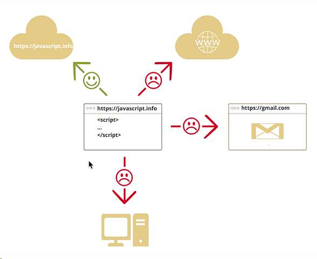
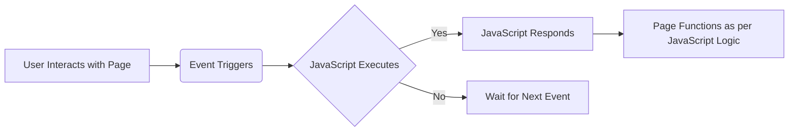

# 🔰JavaScript

Welcome to the 🔰JavaScript module! This signifies that we are close enough to begin preparing our project game for development for the 🪶Mid Term Exam. This module will 🎯cover the basics of JavaScript and how to use it in your web pages.

- [🔰 What's JavaScript?](#51----whats-javascript)
- [🤔💭 Why using JavaScript?](#52----why-using-javascript)
- [👨🏻‍💻🧑🏻‍💻 Who's using this tech?](#53----whos-using-this-tech)
- [📍 Where we uses JavaScript?](#54----where-we-uses-javascript)
- [🤷🏻‍♂️ How JavaScript works?](#55----how-javascript-works)
  - [Event](#551---event)
- [🧩 JavaScript Syntax](#55---javascript-syntax)
  - [Statements](#551---statements)
  - [Basic Functions](#552---basic-functions)
  - [Hello World](#553---hello-world)
  - [Event Handling](#554---event-handling)
  - [Accessing elements](#555---accessing-elements)
- [🍎 Variables](#55---variables)
- [📦 Data Types](#56---data-types)
  - [Implicit Data Type](#561---implicit-data-type)
- [📦 Operators](#57---operators)
  - [Arithmetic Operators](#571---arithmetic-operators)
  - [Assignment Operators](#572---assignment-operators)
  - [Comparison Operators](#573---comparison-operators)
  - [Logical Operators](#574---logical-operators)
  - [Type Operators](#575---type-operators)
- [🍵 Similar to Java](#58---similar-to-java)
  - [Conditional Statements](#581---conditional-statements)
  - [Loops](#582---loops)
- [✒️Assignment](#59-️-assignment)

## Quick Links

- [📑Module](5.%20JavaScript.pdf)
- [🧐My Works](max-number-finder.html)

## 5.1 - 🔰 What's JavaScript?

JavaScript is a programming language that enables you to create dynamically updating content, control multimedia, animate images, and much more. JavaScript is a scripting language that enables you to create dynamically updating content, control multimedia, animate images, and much more. (Source: [MDN Web Docs](https://developer.mozilla.org/en-US/docs/Web/JavaScript)).

Was script language that in the beginning of development used to to run in the client side, but now it's possible to run in the server side like Server, IoT, Desktop, Mobile, etc. with Node.js. And it's now supported by all major browsers.

JavaScript making web more interactive and dynamic, like

- Inserting new HTML content, modification of existing content, and changing the styles of HTML elements.
- Reacting to user actions, such as mouse clicks, form input, and page navigation.
- Sending and receiving data from a server, such as a database or an API.
- Running code at scheduled time intervals, such as when a page is finished loading or when a user has been inactive for a certain amount of time.
- Storing data on the client's computer, such as cookies or local storage.



It's not the same as Java, but it's similar in syntax and structure. It's a high-level, interpreted programming language that conforms to the ECMAScript specification. JavaScript has curly-bracket syntax, dynamic typing, prototype-based object-orientation, and first-class functions. More relaxed syntax and rules than Java, key constructs is the function rather than classes, and it's a lot more flexible and forgiving than Java.

## 5.2 - 🤔💭 Why using JavaScript?

- Faster User Experience
- Making web more interactive and dynamic
- As a validator for user input
- As a Servers application (Node.js)
- Used to build web applications, mobile, and games development


And lastly, it was the most popular technology in 2020, and it's still growing.

## 5.3 - 👨🏻‍💻🧑🏻‍💻 Who's using this tech?

- Front-end developers
- HTML + CSS + JS
- Framework CSS + Framework JavaScript
- API(REST, RESTful, GraphQL)

## 5.4 - 📍 Where we uses JavaScript?

We uses JavaScript between `<script>` tag in the HTML file, or in a separate file with the `.js` extension.

````html
<!DOCTYPE html>
<html>
  <head>
    <title>My First JavaScript</title>
  </head>
  <body>
    <h1>My First Web Page</h1>
    <p>My first paragraph.</p>

    <script>
      alert("Hello World");
    </script>
  </body>
</html>

Also we can use in a separate file, like this: ```html
<!DOCTYPE html>
<html>
  <head>
    <title>My First JavaScript</title>
    <script src="myScript.js"></script>
  </head>
  <body>
    <h1>My First Web Page</h1>
    <p>My first paragraph.</p>
  </body>
</html>
````

## 5.5 - 🤷🏻‍♂️ How JavaScript works?

Event Driven Programming



### 5.5.1 - Event

An event is something that happens to the HTML document or the browser. Here are some examples of HTML events:

```
- OnSubmit      --> will run when submit button is `clicked`
- OnClick       --> will run when the user `clicks` on the button
- OnMouseOver   --> will run when the user moves the `mouse over` an element
- OnMouseOut    --> will run when the user moves the `mouse away` from an element
- OnKeyDown     --> will run when the user `presses` a key
- OnLoad        --> will run when the page is `finished loading`
- OnUnload      --> will run when the user `leaves` the page
- OnChange      --> will run when the user `changes` the value of a text field
etc.
```

## 5.5 - 🧩 JavaScript Syntax

### 5.5.1 - Statements

```JavaScript
<script src="filename" type="text/javascript"></script>
```

### 5.5.2 - Basic Functions

```JavaScript
function myFunction() {
  statement;
  ...
  statement;
}
```

### 5.5.3 - Hello World

```JavaScript
alert('Hello, World!');
```

### 5.5.4 - Event Handling

```html
<!DOCTYPE html>
<html>
  <head>
    <title>My First JavaScript</title>
  </head>
  <body>
    <h1>My First Web Page</h1>
    <p>My first paragraph.</p>

    `<button onclick="myFunction()">Click me</button>`

    <script>
      function myFunction() {
        alert("Hello World!");
      }
    </script>
  </body>
</html>
```

On the above example, when the user clicks on the button, the `myFunction` function will be executed.

### 5.5.5 - Accessing elements

```html
<!DOCTYPE html>
<html>
  <head>
    <title>My First JavaScript</title>
  </head>
  <body>
    <h1>My First Web Page</h1>
    <p>My first paragraph.</p>

    <button onclick="document.getElementById('demo').innerHTML = Date()">
      The time is?
    </button>

    <p id="demo"></p>
  </body>
</html>
```

How we access the elements is by using the `document` object, and the `getElementById` method. The `innerHTML` property is used to change the content of the HTML element. In this case, the content of the paragraph with the `id="demo"` will be changed to the current date and time.

## 5.5 - 🍎 Variables

In JavaScript, we can declare variables using the `var` keyword. Variables are containers for storing data values. It's case sensitive, and it's a good practice to use camelCase for variable names. And when we declare a variable we don't need to specify the data type.

```JavaScript
var x = 5;
var y = 6;
var z = x + y;
```

## 5.6 - 📦 Data Types

In JavaScript, we have several data types, such as:

- Primitive Data Types
  - String
  - Number
  - Boolean
  - Undefined
  - Null
  - Symbol
- Composite Data Types
  - Object
  - Array
  - Function

### 5.6.1 - Implicit Data Type

- When you have an expression which combines two numbers, it'll evaluate to a number.
- When you have an expression which combines a number and a string, it'll evaluate to a string.

```JavaScript
var x = 5 + 7; // x will be 12
var x = 5 + "7"; // x will be 57
```

## 5.7 - 📦 Operators

### 5.7.1 - Arithmetic Operators

- Addition: `+`
- Subtraction: `-`
- Multiplication: `*`
- Division: `/`
- Modulus: `%`
- Increment: `++`
- Decrement: `--`

### 5.7.2 - Assignment Operators

- `=`: Assigns a value to a variable
- `+=`: Adds a value to a variable
- `-=`: Subtracts a value from a variable
- `*=`: Multiplies a variable
- `/=`: Divides a variable
- `%=`: Modulus a variable

### 5.7.3 - Comparison Operators

- `==`: Equal to
- `===`: Equal value and equal type
- `!=`: Not equal
- `!==`: Not equal value or not equal type
- `>`: Greater than
- `<`: Less than
- `>=`: Greater than or equal to
- `<=`: Less than or equal to

### 5.7.4 - Logical Operators

- `&&`: Logical and
- `||`: Logical or
- `!`: Logical not

### 5.7.5 - Type Operators

- `typeof`: Returns the type of a variable
- `instanceof`: Returns true if an object is an instance of an object type

## 5.8 - 🍵 Similar to Java

### 5.8.1 - Conditional Statements

```JavaScript
if (condition) {
  // block of code to be executed if the condition is true
} else {
  // block of code to be executed if the condition is false
}
```

### 5.8.2 - Loops

- `for`: Loops through a block of code a number of times
- `while`: Loops through a block of code while a specified condition is true
- `do...while`: Loops through a block of code once, and then repeats the loop while a specified condition is true

```JavaScript
for (i = 0; i < 5; i++) {
  // block of code to be executed
}

while (i < 10) {
  // block of code to be executed
  i++;
}

do {
  // block of code to be executed
  i++;
} while (i < 10);
```

### 5.9 ✒️ Assignment

Make a JS program that receives 3 numbers and returns the highest number. Show output in the same page.
