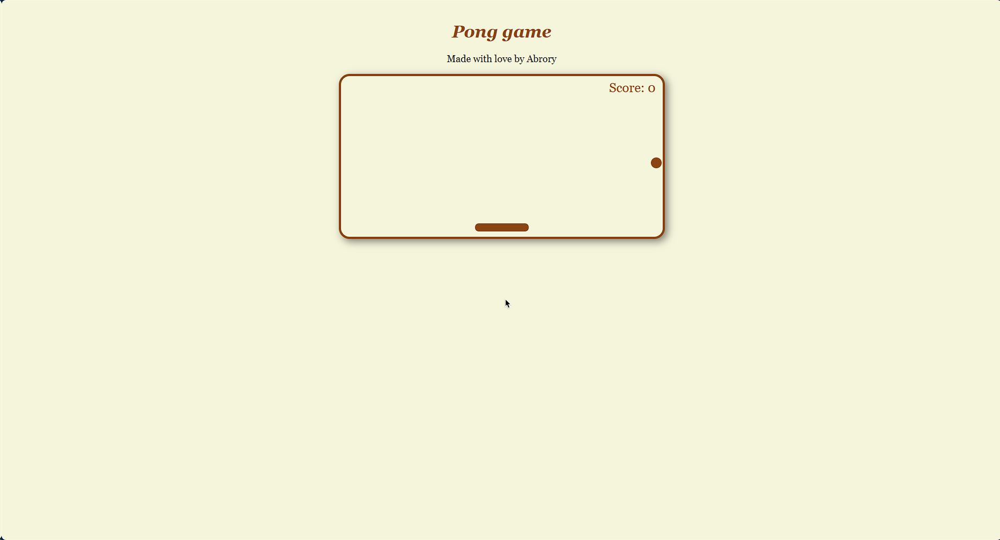

# 🌐🍵 Explore HTML5 + JavaScript, the Web Fuel!

HTML5 and JavaScript are two key technologies for the web world. They complement each other in creating cool interactive web experiences!

---

- [🌐 HTML5 (_HyperText Markup Language_)](#-html5-hypertext-markup-language)
- [📜 JavaScript](#-javascript)
- [🥊 Comparison between HTML5 and Flash](#-comparison-between-html5-and-flash)
- [🖼️ Canvas](#-canvas)
  - [Creating a Canvas](#creating-a-canvas)
  - [Drawing on the Canvas](#drawing-on-the-canvas)
  - [Drawing an Object](#drawing-an-object)
  - [Move an Object](#move-an-object)
  - [Controlling an Object](#controlling-an-object)
- [📖 Other Resources](#-others-resources)
- [🧑🏻‍💻 Let's Explore Canvas!](#-self-canvas-hands-on)

---

## 🌐 HTML5 (_HyperText Markup Language_)

HTML5 is the latest version of HTML that brings many new and exciting features:

1. **Semantics**: New elements like `<header>`, `<footer>`, `<article>`, `<section>`, `<nav>`, `<aside>`, and `<main>` help to define the structure of a web page more clearly.
2. **Multimedia**: The `<audio>` and `<video>` elements make it easy to embed media content into a web page.
3. **Graphics**: The `<canvas>` element provides a way to draw graphics on a web page using JavaScript.
4. **Forms**: New input types like `email`, `url`, `number`, `range`, `date`, `time`, `color`, and `search` make it easier to create forms with better user experiences.

## 📜 JavaScript: Building Web Interactivity

As we mention on previous module JavaScript is a programming language used to create interactive and dynamic websites. It is a core technology of the web, alongside HTML and CSS, and is supported by all modern web browsers without plugins.

1. **Dom Manipulation**: JavaScript can be used to manipulate the DOM (Document Object Model) of a web page, allowing for dynamic updates to the content and structure of a web page.
2. **Event Handling**: JavaScript can be used to handle user interactions with a web page, such as mouse clicks, keyboard input, and form submissions.
3. **Asynchronous Requests**: JavaScript can be used to make asynchronous requests to a web server, allowing for dynamic updates to a web page without requiring a full page reload.
4. **Animation**: JavaScript can be used to create animations and transitions on a web page, allowing for more engaging user experiences.
5. **Framework and Library**: JavaScript has a wide range of frameworks and libraries that can be used to simplify web development, such as React, Angular, and Vue.js.

## 🥊 HTML5 vs Flash: Duel of Technologies

| **Aspect**      | **HTML5**                  | **Flash**                                                   |
| --------------- | -------------------------- | ----------------------------------------------------------- |
| **Arrival**     | Latest version of HTML     | Older Media                                                 |
| **Support**     | Supported by all browsers  | Requires a plugin                                           |
| **Performance** | Lighter                    | Heavier                                                     |
| **Resources**   | More efficient             | Requires an extra plugin                                    |
| **Cost**        | Free , Open Source         | Paid development environment                                |
| **Support**     | Varying support            | Good support                                                |
| **Tools**       | Construct 2 (HTML5 editor) | A flash builder-like tool is, although mature but expensive |
| **Friendly**    | SEO-friendly               | Less SEO-friendly                                           |

## 🖼️ Canvas in HTML5: The Drawing Area

The `<canvas>` element is a new HTML5 element that can be used to draw graphics on a web page using JavaScript. It provides a drawing area that can be used to create graphics, animations, and interactive content.

### Creating a Canvas

```html
<canvas
  id="myCanvas"
  width="200"
  height="100"
  style="border:1px solid #000000;"></canvas>
```

By default canvas doesn't have any border, so we can add a border using the style attribute.

### Drawing on the Canvas

```javascript
var c = document.getElementById("myCanvas");
var ctx = c.getContext("2d");
ctx.fillStyle = "#FF0000";
ctx.fillRect(0, 0, 150, 75);
```

Anything that drawn on canvas must using JavaScript.

### Drawing an Object

```javascript
var c = document.getElementById("myCanvas");
var ctx = c.getContext("2d");
ctx.beginPath();
ctx.arc(95, 50, 40, 0, 2 * Math.PI);
ctx.stroke();
```

### Move an Object

For running function in a loop we can use `setInterval` function or `requestAnimationFrame` function.

```javascript
function draw() {
  var canvas = document.getElementById("myCanvas");
  var ctx = canvas.getContext("2d");
  ctx.clearRect(0, 0, canvas.width, canvas.height);
  ctx.beginPath();
  ctx.arc(x, 50, 40, 0, 2 * Math.PI);
  ctx.stroke();
  x++;
  if (x > canvas.width) {
    x = 0;
  }
}
setInterval(draw, 1000);
```

### Controlling an Object

First thing we need is an

1. **Variable to store the position of the object.**

```javascript
var rightPressed: false;
var leftPressed: false;
```

2. **Event listener to listen to the key press event.**

```javascript
document.addEventListener("keydown", keyDownHandler, false);
document.addEventListener("keyup", keyUpHandler, false);
```

3. **Function to handle event**.

```javascript
function keyDownHandler(e) {
  if (e.key == "Right" || e.key == "ArrowRight") {
    rightPressed = true;
  } else if (e.key == "Left" || e.key == "ArrowLeft") {
    leftPressed = true;
  }
}

function keyUpHandler(e) {
  if (e.key == "Right" || e.key == "ArrowRight") {
    rightPressed = false;
  } else if (e.key == "Left" || e.key == "ArrowLeft") {
    leftPressed = false;
  }
}
```

4. **Ability to controlling over object**

```javascript
if (rightPressed && paddleX < canvas.width - paddleWidth) {
  paddleX += 7;
} else if (leftPressed && paddleX > 0) {
  paddleX -= 7;
}
```

## 📖 Others Resources

1. **_Books_**: "HTML & CSS: Design and Build Websites" by Jon Duckett and "Eloquent JavaScript" by Marijn Haverbeke.
2. **_Online_** Tutorials: freeCodeCamp, MDN Web Docs, Codecademy, and W3Schools.
3. **_Courses_**: Courses on platforms like Udemy, Coursera, edX, or other online learning sources.
4. **_Official Documentation_**: HTML5 at https://html.spec.whatwg.org/ and JavaScript at https://developer.mozilla.org/en-US/docs/Web/JavaScript.
5. **_Online Communities_**: Join communities like the /r/HTML, /r/JavaScript subreddit, or other forums to discuss and learn from other developers.

## 🧑🏻‍💻 Let's Explore Canvas!

How about that? HTML5 and JavaScript are truly awesome for creating modern interactive websites! 🚀 Let's explore the sample code in [canvas.html](canvas.html), [style-canvas.css](style-canvas.css) and [script.js](script.js)!


